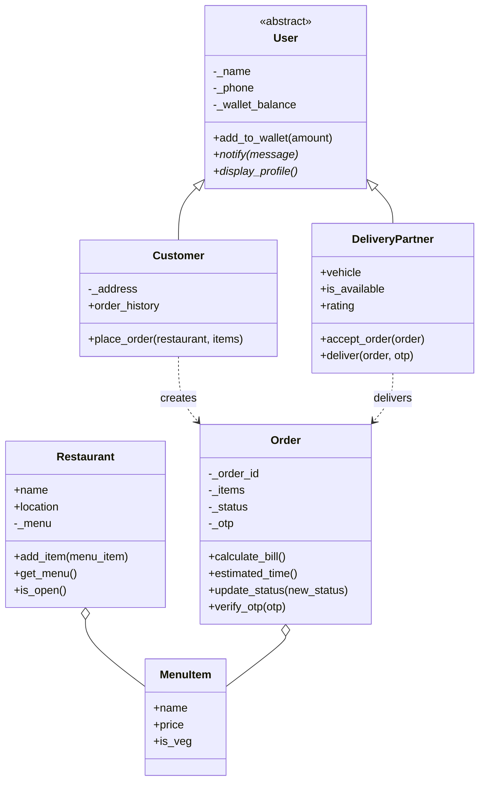
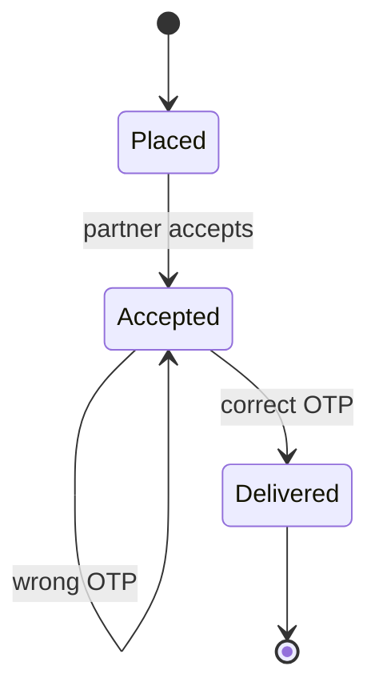

# 🍔 Food Delivery OOP Project

🚀 **Live Demo:** https://food-delivery-egdhbbo89ebaejcxiebmpn.streamlit.app/

A simple Food Delivery System built using Object-Oriented Programming in Python and Streamlit.# Food-Delivery
Food Delivery System using Python and Streamlit
<div align="center">

# 🍽️ Food Delivery System

### An object-oriented food delivery engine in pure Python


*Register. Order. Pay. Verify. Deliver.*

</div>

---

## ✨ Overview

**Food Delivery System** models the core workflow of apps like Swiggy or Zomato using clean, well-structured object-oriented Python. It covers the full journey of an order: from registering users and building a restaurant menu, to calculating the bill, accepting the order, verifying an OTP at the doorstep, and notifying everyone involved.

It uses only the Python standard library, so there is nothing to install.

## 🎯 Highlights

| | Feature | Details |
|---|---|---|
| 👤 | **User registration** | Customers and delivery partners share a common abstract `User` base |
| 💰 | **Wallet top-up** | Zero or positive amounts are credited; negative amounts are rejected |
| 🍛 | **Menu management** | Restaurants hold `MenuItem` objects with price and veg/non-veg flag |
| 🧾 | **Automatic billing** | Subtotal + 5% GST + ₹20 packaging fee |
| 🔐 | **OTP-verified delivery** | A wrong OTP leaves the order `Accepted` and the partner busy |
| 🔔 | **Role-specific notifications** | Customers and partners see differently worded messages (polymorphism) |
| 🚦 | **Order lifecycle** | `Placed` → `Accepted` → `Delivered` |

## 🧭 System Flow


## 🏗️ Architecture



### Order lifecycle



### OOP concepts demonstrated

- **Abstraction**: `User` is an abstract base class (`ABC`) and cannot be instantiated directly.
- **Inheritance**: `Customer` and `DeliveryPartner` extend `User` and reuse its wallet logic.
- **Polymorphism**: `notify()` and `display_profile()` behave differently for each user type.
- **Encapsulation**: internal state such as `_wallet_balance`, `_menu`, `_status`, and `_otp` is kept non-public by convention.
- **Composition**: a `Restaurant` holds `MenuItem` objects, and an `Order` holds the items selected.

## 🧾 Billing Rule

```
Total = Subtotal + (Subtotal × 5% GST) + ₹20 packaging fee
```

**Example:** Biryani (₹250) + Kebab (₹180)

| Component | Amount |
|---|---|
| Subtotal | ₹430.00 |
| GST (5%) | ₹21.50 |
| Packaging fee | ₹20.00 |
| **Total** | **₹471.50** |

Estimated delivery time is a fixed **30 minutes**.

## 🚀 Getting Started

### Prerequisites

- Python 3.8 or newer
- No third-party packages required

### Run the demo

```bash
# 1. Get the project files into one folder
#    food_delivery.py   (all class definitions)
#    demo.py            (end-to-end demonstration)

# 2. Run
python demo.py
```

> **Note:** `demo.py` must import the classes at the top with `from food_delivery import *`.

### Sample output

```text
Total Bill: ₹471.5
Estimated Time: 30 mins
Rajesh has accepted the order.
Incorrect OTP! Order not delivered.
OTP verified. Order delivered by Rajesh.
Notification for Priya: Order delivered successfully.
Delivery Partner Rajesh Notification: Delivery complete, you are now available.
```

## 💻 Usage Example

```python
from food_delivery import Customer, DeliveryPartner, Restaurant, MenuItem

# Register users
priya = Customer("Priya", "9876543210", "Bangalore")
rajesh = DeliveryPartner("Rajesh", "9998887776", "Bike")

# Build a restaurant menu
bawarchi = Restaurant("Bawarchi", "MG Road")
biryani = MenuItem("Biryani", 250, is_veg=False)
kebab = MenuItem("Kebab", 180, is_veg=False)
bawarchi.add_item(biryani)
bawarchi.add_item(kebab)

# Wallet top-up (negative amounts are ignored)
priya.add_to_wallet(500)
priya.add_to_wallet(-100)

# Place an order and check the bill
order = priya.place_order(bawarchi, [biryani, kebab])
print(order.calculate_bill())      # 471.5

# Deliver with OTP verification
rajesh.accept_order(order)
rajesh.deliver(order, 9999)        # rejected
rajesh.deliver(order, 1234)        # delivered

# Notify both parties
priya.notify("Order delivered successfully.")
rajesh.notify("Delivery complete, you are now available.")
```

## 📁 Project Structure

```text
food-delivery-system/
├── food_delivery.py   # User, Customer, DeliveryPartner, MenuItem, Restaurant, Order
├── demo.py            # End-to-end demonstration of the full workflow
└── README.md          # You are here
```

## 📚 API Reference

| Class | Key members |
|---|---|
| `User` *(abstract)* | `add_to_wallet(amount)`, `notify(message)`, `display_profile()` |
| `Customer` | `address`, `order_history`, `place_order(restaurant, items)` |
| `DeliveryPartner` | `vehicle`, `is_available`, `rating`, `accept_order(order)`, `deliver(order, otp)` |
| `MenuItem` | `name`, `price`, `is_veg` |
| `Restaurant` | `name`, `location`, `add_item(item)`, `get_menu()`, `is_open()` |
| `Order` | `calculate_bill()`, `estimated_time()`, `update_status(status)`, `verify_otp(otp)` |

## 🛣️ Roadmap

- [ ] Deduct the bill from the customer's wallet, with an insufficient-balance check
- [ ] Validate that ordered items belong to the restaurant's menu and that it `is_open()`
- [ ] Print a full bill breakdown (subtotal, GST, packaging fee)
- [ ] Generate a unique OTP per order instead of a fixed value
- [ ] Delivery partner ratings and assignment of available partners
- [ ] Streamlit web interface on top of the existing classes
- [ ] Unit tests with `unittest` or `pytest`

## 🎓 What I Learned

Designing a small system from scratch with abstract base classes, inheritance, and composition, and keeping each class focused on one responsibility.

## 👤 Author

**[Your Name]**, built as *Project 3: Food Delivery System*.

---

<div align="center">

⭐ If you found this project helpful, consider giving it a star!

</div>
